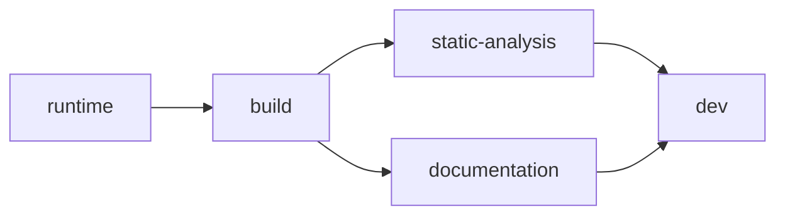

#  cpp-toolchain

Up-to-date C++ toolchain images for the complete development cycle - **GNU and LLVM side by side**, from a minimal runtime to a full dev container.  
Built as a single multi-stage [`Dockerfile`](Dockerfile), published to [Docker Hub](https://hub.docker.com/repository/docker/guillaumedua/cpp-toolchain) and [GHCR](https://github.com/GuillaumeDua/cpp-toolchain/pkgs/container/cpp-toolchain) by [GitHub Actions](.github/workflows/docker-publish.yml).

Every Ubuntu release pins a GCC and a Clang version - 24.04 ships GCC 13 and Clang 18.  
Getting past that means wiring up the toolchain repositories yourself, on every machine and in every CI job.  
Keeping it current then means watching upstream for releases and bumping versions by hand - time spent on the toolchain rather than on the code.  
These images do it once and carry both toolchains, so using GNU or LLVM - or moving between them later - is a matter of which command you run rather than which image you pull.

## Pick your image (one per stage)

Each stage is published as its own image, so you pull only what you need - prefix any version with the stage name: `ghcr.io/guillaumedua/cpp-toolchain:<stage>-latest`

| Stage / tag | What's in it | `latest` | `cross` |
| ----------- | ------------ | -------- | ------- |
| `runtime` | Minimal C++ **runtime** `libc6`, `libgcc-s1`, `libstdc++6`, `libc++1`, `libc++abi1` |    | *(no toolchain)* |
| `build` | **Compile** C++ compilers, build systems, dependency managers |    |   |
| `static-analysis` | `build` + **static analysis** clang-tidy, clang-format, clangd, scan-build, cppcheck, iwyu, lldb |    |   |
| `documentation` | `build` + **documentation** doxygen, graphviz - and lcov reports |    |   |
| `dev` *(default target)* | Full **dev** environment everything above + gdb, valgrind, editors, shells, jq, ripgrep |    |   |

The `-cross` images carry per-target cross toolchains (~+200 MB installed per target), so reach for them only when you cross-compile - see [Cross-compilation](docs/CROSS-COMPILATION.md).
`runtime` has no toolchain, so it is published once, without a cross variant.  
What each version means - `latest`, pre-release `v<major>.<minor>-rc.<n>`, pinned `v<major>.<minor>` - is detailed in [Tags & versioning](#tags--versioning).

## How to use this project

- [Using the images](docs/IMAGES.md)
  - [Visual Studio Code dev container](https://code.visualstudio.com/docs/devcontainers/containers)
  - `GitHub Actions`
  - `GitLab` CI
  - [Docker Compose](https://docs.docker.com/compose/)
  - One-off `docker run`
  - Remote SSH
  - building your own variant
  - etc.
- [Using standalone scripts](scripts/README.md) has the same toolchain without `Docker`.  
  The install scripts run on any Debian/Ubuntu host, no image involved.

## Key features

- **Five stages**, from a minimal runtime to a full dev environment - so you pull only what you need ([Pick your image/stage](#pick-your-image-one-per-stage)).
- **Both toolchains side by side**: GNU `g++`/`libstdc++` and LLVM `clang++`/`libc++`, a pinned major of each ([Compilers & standard library](#compilers--standard-library)).
- **Several compiler versions at once**, wired through `update-alternatives` ([Build your own image](docs/IMAGES.md#build-your-own-image)).
- **Coverage** for both ecosystems: `gcov`/`lcov` and `llvm-cov`/`llvm-profdata` ([Code coverage](docs/COVERAGE.md)).
- **Cross-architecture compilation**: opt-in `-cross` images that compile *and* link for `arm64`, `arm32` hard-float and `riscv64` - or any supported triplet in a custom build ([Cross-compilation](docs/CROSS-COMPILATION.md)).
- **Multilib**: secondary host ABIs via `-m32` / `-mx32` ([Multilib](docs/CROSS-COMPILATION.md#multilib---secondary-abis)).
- **Ready as a dev container**: one `devcontainer.json` pointing at `dev-latest`, plus an opt-in `SSH` layer for Remote-SSH ([Dev container](docs/IMAGES.md#visual-studio-code---dev-container)).
- **Usable without Docker**: the install scripts run standalone on any Debian/Ubuntu host ([Standalone scripts](scripts/README.md)).

## What's inside

The stages form a diamond: `static-analysis` and `documentation` both build on `build`; `dev` inherits `static-analysis` and re-adds the documentation tools.

<b>Full package matrix</b> - what lands in which stage

| Category                                                                                                        | `runtime` | `build` | `static-analysis` | `documentation` | `dev` |
| --------------------------------------------------------------------------------------------------------------- | :-------: | :-----: | :---------------: | :-------------: | :---: |
| C++ runtime libraries - GNU (`libc6`, `libgcc-s1`, `libstdc++6`)                                                |    ✅     |   ✅    |        ✅         |       ✅        |  ✅   |
| C++ runtime libraries - LLVM (`libc++1`, `libc++abi1`)                                                          |    ✅     |   ✅    |        ✅         |       ✅        |  ✅   |
| Compilers: GNU-G++, LLVM-Clang++                                                                                |           |   ✅    |        ✅         |       ✅        |  ✅   |
| Cross-compilation: per-target GNU toolchains via `g++-<triplet>` ([opt-in](docs/CROSS-COMPILATION.md))          |           |   ✅    |        ✅         |       ✅        |  ✅   |
| Multilib: secondary ABIs `-m32` / `-mx32`                                                                       |           |   ✅    |        ✅         |       ✅        |  ✅   |
| Build systems: CMake, make/Unix-makefile, ninja, ccache (+ opt-in Bazel, Build2)                                |           |   ✅    |        ✅         |       ✅        |  ✅   |
| Dependency management: vcpkg, conan (python3)                                                                   |           |   ✅    |        ✅         |       ✅        |  ✅   |
| Versioning: git                                                                                                 |           |   ✅    |        ✅         |       ✅        |  ✅   |
| Coverage (GNU): gcov, gcov-tool                                                                                 |           |   ✅    |        ✅         |       ✅        |  ✅   |
| Coverage (LLVM): llvm-cov, llvm-profdata                                                                        |           |         |        ✅         |       ✅        |  ✅   |
| Static analysis: clang-tidy, clang-format, clangd, scan-build, cppcheck, iwyu (+ lldb)                          |           |         |        ✅         |                 |  ✅   |
| Documentation: doxygen, graphviz - and coverage reports: lcov / genhtml                                         |           |         |                   |       ✅        |  ✅   |
| Dynamic analysis / debug: valgrind, gdb                                                                         |           |         |                   |                 |  ✅   |
| Versioning extra: subversion                                                                                    |           |         |                   |                 |  ✅   |
| Editors: emacs, nano, vim                                                                                       |           |         |                   |                 |  ✅   |
| Shells: bash, zsh                                                                                               |           |         |                   |                 |  ✅   |
| Misc: jq, ripgrep, docker-compose                                                                               |           |         |                   |                 |  ✅   |

`build` installs Clang minimalistically: only `clang`/`clang++` answer to an unversioned name there, though the upstream installer's default set also leaves `lld-<N>`, `lldb-<N>` and `clangd-<N>` behind.
The full LLVM tooling (`clang-tidy`, `clang-format`, `clangd`, `lldb`, `scan-build`, ...) is installed and registered in `static-analysis`, and inherited by `dev`.

## Tags & versioning

A tag is `<stage>[-cross]-<version>`: the **stage** picks *what is in the image*, the optional **`cross`** picks the *cross-arch flavor*, and the **version** picks *how fresh it is*.

| Version | Published by | Meaning |
| ------- | ------------ | ------- |
| `v<major>.<minor>` (e.g. `build-v1.0`) | **major**: a GitHub release, cut by hand from `main` **minor**: **promoted by hand** from a release candidate | A specific **release**, pinned and immutable; the version matches the release tag exactly |
| `latest` (e.g. `build-latest`) | the newest release, major or minor | Newest **release** - what you want unless you know otherwise |
| `v<major>.<minor>-rc.<n>` (e.g. `build-v1.2-rc.1`) | the twice-monthly **rc schedule** ([cadence](docs/RELEASE_PROCESS.md)), from `main` | A **release candidate** for the next minor: *ahead of* `latest`, so upstream breakage surfaces before it reaches a release. Never aliased to `latest` |

The three channels differ in *who decides*, not in what they contain:

- **major** = the image contract changed - a base-image bump, a stage added or removed, a tool dropped.
  Only a human decides that.
- **minor** = a validated rc, promoted.
  Renovate moved versions, the rc proved they hold up, a human shipped it.
  A compiler major bump arrives this way too: GCC or Clang moving to a new major ships as a minor, so `latest` can change compiler major.
  Pin `v<major>.<minor>` when that matters.
- **rc** = a fresh build from `main`, published early for validation.

Every version in the image is **pinned** in the [Dockerfile](Dockerfile) and updated by [Renovate](renovate.json), so a scheduled run **publishes nothing when nothing changed** - no release is cut just because a date arrived.

> [!NOTE]
> A minor is not rebuilt from its rc's commit - it **is** the rc: promotion re-tags the exact image digests that were validated, so `v1.2` is byte-identical to the `v1.2-rc.<n>` it was promoted from.
> Both tags resolve to that one digest, which is the digest `releases/v1.2.yaml` records.
> rc tags stay published and cost nothing (shared digests).
> How releases are cut is documented in [docs/RELEASE_PROCESS.md](docs/RELEASE_PROCESS.md).

`dev` is the Dockerfile's default target, so it also answers to the **unprefixed** versions - `cpp-toolchain:latest` is the same digest as `cpp-toolchain:dev-latest`, and likewise for `v1.0` / `v1.2-rc.1` (and `cross-latest` = `dev-cross-latest`).
Every other stage must be named explicitly.

### What's inside a given tag

Every release note lists the versions that release pins - compilers, build systems, dependency managers, documentation tooling - what moved since the previous one, and the pull requests merged in between.
Those pins are what the image **requests**, which is not always what it resolves to.
GCC and Clang pin a **major** and install from rolling apt sources (`ppa:ubuntu-toolchain-r/test` and `apt.llvm.org`), so two builds of the same commit weeks apart can carry different patch releases of the same compiler major.
The Ubuntu archive is pinned by `UBUNTU_SNAPSHOT`; the rest pins an upstream version.

> [!NOTE]
> **On host architecture**:
>
> The published images are `linux/amd64` (not yet multi-platform manifests), so on an **arm64** host they run under emulation.  
> Because the toolchain already **cross-compiles** to **arm64** and beyond, a native **arm64** image is seldom needed - but when you want to build, run or debug *on* the target platform itself, the same [Dockerfile](Dockerfile) rebuilds for other architectures on a **best-effort** basis - natively via `docker build` on an arm64 host, or `docker buildx build --platform linux/arm64 --load` (through QEMU) on **amd64**.

> [!WARNING]
> A few pieces degrade on non-amd64: `Doxygen` falls back to the distro apt package, and `Bazel` and the `-m32` / `-mx32` multilib are **amd64-only** (skipped with a log).

## Compilers & standard library

Available from the **`build`** stage onwards.
Both toolchains are installed side by side - the pinned version of each by default:

| Toolchain | Command             | Versioned command           | Also registered                                                  |
| --------- | ------------------- | --------------------------- | ---------------------------------------------------------------- |
| GNU       | `gcc` / `g++`       | `gcc-<N>` / `g++-<N>`       | `gcov`, `gcov-tool`                                              |
| LLVM      | `clang` / `clang++` | `clang-<N>` / `clang++-<N>` | `clang-tidy`, `clangd`, `lldb`, ... in `static-analysis` / `dev` |

Unversioned commands are `update-alternatives` symlinks; the **latest-stable version always has the highest priority**.
Switching the default, or installing several versions at once, is [Choosing a compiler version](docs/IMAGES.md#choosing-a-compiler-version).

| Compiler  | Default standard library                | Alternative      |
| --------- | --------------------------------------- | ---------------- |
| `g++`     | `libstdc++`                             | -                |
| `clang++` | `libstdc++` (GCC's - the Linux default) | `-stdlib=libc++` |

libc++ (`libc++-<N>-dev`, `libc++abi-<N>-dev`, `libunwind-<N>-dev`) is installed for the **host** architecture, so the LLVM toolchain is fully usable *without* GCC.

The `runtime` image carries the matching shared libraries (`libc++1`, `libc++abi1`) beside `libstdc++6`, so it runs everything `build` can produce - `g++`, `clang++`, and `clang++ -stdlib=libc++` alike.
That all three still run there is asserted by the [validation gate](docs/IMAGES_VALIDATION.md), not assumed.

## Going further

Everything below is also published as a browsable site at <https://guillaumedua.github.io/cpp-toolchain>.

| Document | Content |
| -------- | ------- |
| [docs/IMAGES.md](docs/IMAGES.md) | Using the images: dev container, GitHub Actions, GitLab CI, Compose, one-off runs, remote SSH, custom builds |
| [scripts/README.md](scripts/README.md) | Without Docker: which scripts are standalone, and how to fetch and run one |
| [docs/CROSS-COMPILATION.md](docs/CROSS-COMPILATION.md) | Cross-architecture compilation: published targets, what links and what does not, multilib |
| [docs/COVERAGE.md](docs/COVERAGE.md) | Code coverage: GNU `gcov`/`lcov` and LLVM `llvm-cov`/`llvm-profdata` |
| [docs/IMAGES_VALIDATION.md](docs/IMAGES_VALIDATION.md) | Images validation gate: what proves an image still fills its purpose, and how to run it |
| [scripts/install/README.md](scripts/install/README.md) | Installation scripts reference: `cmake.sh`, `gcc.sh`, `llvm.sh`, `binutils.sh` |
| [HOW_TO_CONTRIBUTE.md](HOW_TO_CONTRIBUTE.md) | Contribution workflow |

## Dependency updates

**Every version is pinned in the [Dockerfile](Dockerfile)** - base image (by digest), GCC, Clang/LLVM, CMake, vcpkg, Conan, Doxygen, build2, oh-my-zsh (by commit) and powerlevel10k - and each pin is tracked by [Renovate](renovate.json).
The actions the [workflows](.github/workflows) run are pinned to commit digests and tracked the same way.
Nothing resolves to "whatever is newest" at build time.

That has two consequences worth knowing:

- **Updates arrive as reviewable pull requests**, not silently on a rebuild.
  A version bump that the upstream apt repository has not published yet fails the build gate, so it stays a red PR instead of a broken image.
- **The ~20 distro packages** (`ninja`, `cppcheck`, `valgrind`, `gdb`, `lcov`, ...) are frozen by an [Ubuntu archive snapshot](https://snapshot.ubuntu.com) rather than pinned one by one.
  The timestamp moves monthly via [ubuntu-snapshot](.github/workflows/ubuntu-snapshot.yml) - Renovate cannot track it, because the service publishes no index of valid timestamps.

> [!NOTE]
> **On reproducibility**
>
> Two builds of the same commit install the same distro package set, frozen by the archive snapshot, and the same exactly-pinned tools.  
> They do **not** produce the same image: GCC and Clang pin a major, so each build takes whatever patch level the PPA and `apt.llvm.org` serve that day.  
> Rebuilding a *years-old* tag is weaker still: those repositories keep no superseded versions.  
> The published image is the durable artifact, not the ability to recreate it.

## Contributing

Issues and pull requests are welcome - see [HOW_TO_CONTRIBUTE.md](HOW_TO_CONTRIBUTE.md) for the workflow.

## License

MIT - see [LICENSE](LICENSE).
