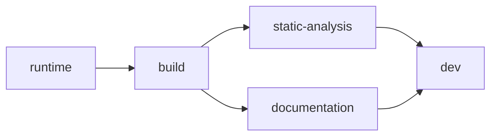

# cpp-toolchain

[](https://hub.docker.com/repository/docker/guillaumedua/cpp-toolchain/general)
[](https://github.com/GuillaumeDua/cpp-toolchain/actions/workflows/docker-build.yml)
[](https://github.com/GuillaumeDua/cpp-toolchain/actions/workflows/docker-publish.yml)
[](https://guillaumedua.github.io/cpp-toolchain)

Up-to-date C++ toolchain images for the complete development cycle - **GNU and LLVM side by side**, from a minimal runtime to a full dev container.  
Built as a single multi-stage [`Dockerfile`](Dockerfile), published to [Docker Hub](https://hub.docker.com/repository/docker/guillaumedua/cpp-toolchain) and [GHCR](https://github.com/GuillaumeDua/cpp-toolchain/pkgs/container/cpp-toolchain) by [GitHub Actions](.github/workflows/docker-publish.yml).

## Pick your image (one per stage)



Each stage is published as its own image, so you pull only what you need - prefix any version with the stage name: `ghcr.io/guillaumedua/cpp-toolchain:<stage>-latest`

| Stage / tag | What's in it | `latest` | `cross` |
| ----------- | ------------ | -------- | ------- |
| `runtime` | Minimal C++ **runtime**<br>`libc6`, `libgcc-s1`, `libstdc++6`, `libc++1`, `libc++abi1` | [](https://hub.docker.com/r/guillaumedua/cpp-toolchain/tags?name=runtime-latest) [](https://hub.docker.com/r/guillaumedua/cpp-toolchain/tags?name=runtime-v)<br> | *(no toolchain)* |
| `build` | **Compile** C++<br>compilers, build systems, dependency managers | [](https://hub.docker.com/r/guillaumedua/cpp-toolchain/tags?name=build-latest) [](https://hub.docker.com/r/guillaumedua/cpp-toolchain/tags?name=build-v)<br> | [](https://hub.docker.com/r/guillaumedua/cpp-toolchain/tags?name=build-cross)<br> |
| `static-analysis` | `build` + **static analysis**<br>clang-tidy, clang-format, clangd, scan-build, cppcheck, iwyu, lldb | [](https://hub.docker.com/r/guillaumedua/cpp-toolchain/tags?name=static-analysis-latest) [](https://hub.docker.com/r/guillaumedua/cpp-toolchain/tags?name=static-analysis-v)<br> | [](https://hub.docker.com/r/guillaumedua/cpp-toolchain/tags?name=static-analysis-cross)<br> |
| `documentation` | `build` + **documentation**<br>doxygen, graphviz - and lcov reports | [](https://hub.docker.com/r/guillaumedua/cpp-toolchain/tags?name=documentation-latest) [](https://hub.docker.com/r/guillaumedua/cpp-toolchain/tags?name=documentation-v)<br> | [](https://hub.docker.com/r/guillaumedua/cpp-toolchain/tags?name=documentation-cross)<br> |
| `dev` *(default target)* | Full **dev** environment<br>everything above + gdb, valgrind, editors, shells, jq, ripgrep | [](https://hub.docker.com/r/guillaumedua/cpp-toolchain/tags?name=dev-latest) [](https://hub.docker.com/r/guillaumedua/cpp-toolchain/tags?name=dev-v)<br> | [](https://hub.docker.com/r/guillaumedua/cpp-toolchain/tags?name=dev-cross)<br> |

The `-cross` images carry per-target cross toolchains (~+200 MB installed per target), so reach for them only when you cross-compile - see [Cross-compilation](docs/CROSS-COMPILATION.md).
`runtime` has no toolchain, so it is published once, without a cross variant.  
What each version means - `latest`, pre-release `v<major>.<minor>-rc.<n>`, pinned `v<major>.<minor>` - is detailed in [Tags & versioning](#tags--versioning).

## Quick start

```bash
# Full dev environment: compilers + analysis + docs + debug, editors, shells
docker pull ghcr.io/guillaumedua/cpp-toolchain:dev-latest

# Lean CI image: compilers + build systems + dependency managers
docker pull ghcr.io/guillaumedua/cpp-toolchain:build-latest

# Check it out
docker run --rm ghcr.io/guillaumedua/cpp-toolchain:build-latest g++ --version
```

> [!TIP] GHCR or Docker Hub ?
> Both registries carry the same images - prefer [GHCR](https://github.com/GuillaumeDua/cpp-toolchain/pkgs/container/cpp-toolchain) for CI, public images there have no anonymous pull rate limit.  
> Working in [VS Code](https://code.visualstudio.com/) ? Open the repo and **Reopen in Container** - see [As a dev environment](#as-a-dev-environment).

## 🌟 Key features

- **Five stages**, from a minimal runtime to a full dev environment - so you pull only what you need ([Pick your image/stage](#pick-your-image-one-per-stage)).
- **Both toolchains side by side**: GNU `g++`/`libstdc++` and LLVM `clang++`/`libc++`, a pinned major of each ([Compilers & standard library](#compilers--standard-library)).
- **Several compiler versions at once**, wired through `update-alternatives` ([Build it yourself](#build-it-yourself)).
- **Coverage** for both ecosystems: `gcov`/`lcov` and `llvm-cov`/`llvm-profdata` ([Code coverage](docs/COVERAGE.md)).
- **Cross-architecture compilation**: opt-in `-cross` images that compile *and* link for `arm64`, `arm32` hard-float and `riscv64` - or any supported triplet in a custom build ([Cross-compilation](docs/CROSS-COMPILATION.md)).
- **Multilib**: secondary host ABIs via `-m32` / `-mx32` ([Multilib](docs/CROSS-COMPILATION.md#multilib---secondary-abis)).
- **Ready as a dev container**: VS Code *Reopen in Container*, plus an opt-in `SSH` layer for Remote-SSH ([As a dev environment](#as-a-dev-environment)).
- **Usable without Docker**: the install scripts run standalone on any Debian/Ubuntu host ([Standalone use](#standalone-use-no-docker)).

## What's inside

The stages form a diamond: `static-analysis` and `documentation` both build on `build`; `dev` inherits `static-analysis` and re-adds the documentation tools.

<details>
<summary><b>📦 Full package matrix</b> - what lands in which stage</summary>

| Category                                                                                                        | `runtime` | `build` | `static-analysis` | `documentation` | `dev` |
| --------------------------------------------------------------------------------------------------------------- | :-------: | :-----: | :---------------: | :-------------: | :---: |
| C++ runtime libraries - GNU (`libc6`, `libgcc-s1`, `libstdc++6`)                                                |    ✅     |   ✅    |        ✅         |       ✅        |  ✅   |
| C++ runtime libraries - LLVM (`libc++1`, `libc++abi1`)                                                          |    ✅     |   ✅    |        ✅         |       ✅        |  ✅   |
| Compilers: GNU-G++, LLVM-Clang++                                                                                |           |   ✅    |        ✅         |       ✅        |  ✅   |
| Cross-compilation: per-target GNU toolchains via `g++-<triplet>` ([opt-in](docs/CROSS-COMPILATION.md))          |           |   ✅    |        ✅         |       ✅        |  ✅   |
| Multilib: secondary ABIs `-m32` / `-mx32`                                                                       |           |   ✅    |        ✅         |       ✅        |  ✅   |
| Build systems: CMake, make/Unix-makefile, ninja, ccache (+ opt-in Bazel, Build2)                                |           |   ✅    |        ✅         |       ✅        |  ✅   |
| Dependency management: vcpkg, conan (python3)                                                                   |           |   ✅    |        ✅         |       ✅        |  ✅   |
| Versioning: git                                                                                                 |           |   ✅    |        ✅         |       ✅        |  ✅   |
| Coverage (GNU): gcov, gcov-tool                                                                                 |           |   ✅    |        ✅         |       ✅        |  ✅   |
| Coverage (LLVM): llvm-cov, llvm-profdata                                                                        |           |         |        ✅         |       ✅        |  ✅   |
| Static analysis: clang-tidy, clang-format, clangd, scan-build, cppcheck, iwyu (+ lldb)                          |           |         |        ✅         |                 |  ✅   |
| Documentation: doxygen, graphviz - and coverage reports: lcov / genhtml                                         |           |         |                   |       ✅        |  ✅   |
| Dynamic analysis / debug: valgrind, gdb                                                                         |           |         |                   |                 |  ✅   |
| Versioning extra: subversion                                                                                    |           |         |                   |                 |  ✅   |
| Editors: emacs, nano, vim                                                                                       |           |         |                   |                 |  ✅   |
| Shells: bash, zsh                                                                                               |           |         |                   |                 |  ✅   |
| Misc: jq, ripgrep, docker-compose                                                                               |           |         |                   |                 |  ✅   |

</details>

`build` installs Clang minimalistically: only `clang`/`clang++` answer to an unversioned name there, though the upstream installer's default set also leaves `lld-<N>`, `lldb-<N>` and `clangd-<N>` behind.
The full LLVM tooling (`clang-tidy`, `clang-format`, `clangd`, `lldb`, `scan-build`, ...) is installed and registered in `static-analysis`, and inherited by `dev`.

## Tags & versioning

A tag is `<stage>[-cross]-<version>`: the **stage** picks *what is in the image*, the optional **`cross`** picks the *cross-arch flavor*, and the **version** picks *how fresh it is*.

| Version | Published by | Meaning |
| ------- | ------------ | ------- |
| `v<major>.<minor>` (e.g. `build-v1.0`) | **major**: a GitHub release, cut by hand from `main`<br>**minor**: **promoted by hand** from a release candidate | A specific **release**, pinned and immutable; the version matches the release tag exactly |
| `latest` (e.g. `build-latest`) | the newest release, major or minor | Newest **release** - what you want unless you know otherwise |
| `v<major>.<minor>-rc.<n>` (e.g. `build-v1.2-rc.1`) | the twice-monthly **rc schedule** ([cadence](docs/RELEASE_PROCESS.md)), from `main` | A **release candidate** for the next minor: *ahead of* `latest`, so upstream breakage surfaces before it reaches a release. Never aliased to `latest` |

The three channels differ in *who decides*, not in what they contain:

- **major** = the image contract changed - a base-image bump, a stage added or removed, a tool dropped.
  Only a human decides that.
- **minor** = a validated rc, promoted.
  Renovate moved versions, the rc proved they hold up, a human shipped it.
- **rc** = a fresh build from `main`, published early for validation.

Every version in the image is **pinned** in the [Dockerfile](Dockerfile) and updated by [Renovate](renovate.json), so a scheduled run **publishes nothing when nothing changed** - no release is cut just because a date arrived.

> [!NOTE]
> A minor is not rebuilt from its rc's commit - it **is** the rc: promotion re-tags the exact image digests that were validated, so `v1.2` is byte-identical to the `v1.2-rc.<n>` it was promoted from.
> rc tags stay published and cost nothing (shared digests).
> How releases are cut is documented in [docs/RELEASE_PROCESS.md](docs/RELEASE_PROCESS.md).

`dev` is the Dockerfile's default target, so it also answers to the **unprefixed** versions - `cpp-toolchain:latest` is the same digest as `cpp-toolchain:dev-latest`, and likewise for `v1.0` / `v1.2-rc.1` (and `cross-latest` = `dev-cross-latest`).
Every other stage must be named explicitly.

### What's inside a given tag

Every release note lists the exact versions that release contains - compilers, build systems, dependency managers, documentation tooling - and what moved since the previous one.
Because the versions are pinned rather than resolved at build time, that list is the image's contents rather than a snapshot of them, and **two builds of the same commit produce the same image**.

> [!NOTE]
> **On host architecture**:
>
> The published images are `linux/amd64` (not yet multi-platform manifests), so on an **arm64** host they run under emulation.  
> Because the toolchain already **cross-compiles** to **arm64** and beyond, a native **arm64** image is seldom needed - but when you want to build, run or debug *on* the target platform itself, the same [Dockerfile](Dockerfile) rebuilds for other architectures on a **best-effort** basis - natively via `docker build` on an arm64 host, or `docker buildx build --platform linux/arm64 --load` (through QEMU) on **amd64**.  
>
> ⚠️ A few pieces degrade on non-amd64: `Doxygen` falls back to the distro apt package, and Bazel and the `-m32` / `-mx32` multilib are **amd64-only** (skipped with a log).

## As a dev environment

These images are built to be your dev container - see [docs/DEVCONTAINER.md](docs/DEVCONTAINER.md) for both workflows:

- **Reopen in Container** (VS Code) needs a [`devcontainer.json`](.devcontainer/devcontainer.json) referencing a [`docker-compose.yaml`](.devcontainer/docker-compose.yaml) - both are in this repo.
- **Remote SSH** uses the opt-in `ssh_support` layer on top of `dev` (SSH on port `2222`).

## Standalone use (no Docker)

The **install scripts are self-contained**: fetch one and run it directly on any `Debian`/`Ubuntu`-based host to get the same toolchain, no image involved.  
Each needs root and takes the same options as the build arguments below (`--help` lists them all):

```bash
# GCC (from the ubuntu-toolchain-r PPA)
wget https://raw.githubusercontent.com/GuillaumeDua/cpp-toolchain/main/scripts/install/gcc.sh
sudo bash gcc.sh --versions='>=13'

# LLVM/Clang (from apt.llvm.org)
wget https://raw.githubusercontent.com/GuillaumeDua/cpp-toolchain/main/scripts/install/llvm.sh
sudo bash llvm.sh --versions='latest-stable'
```

The standards probe travels the same way, and needs no root - give it a compiler and it reports which C++ standards that compiler accepts, which is enough to drive a CI matrix without pulling an image:

```bash
wget https://raw.githubusercontent.com/GuillaumeDua/cpp-toolchain/main/scripts/checks/cxx-standards.sh
bash cxx-standards.sh --stable g++-16
# c++03 -> __cplusplus=199711
# ...
# c++26 -> __cplusplus=202400

# One field at a time, to feed straight back into a build
bash cxx-standards.sh --greatest --stable --format=std g++-16   # c++26
```

> [!TIP] On scripts documentation
> `cmake.sh` and `binutils.sh` work the same way.  
> See [scripts/install/README.md](scripts/install/README.md) for the full `cmake.sh` / `gcc.sh` / `llvm.sh` / `binutils.sh` option reference,
> [scripts/checks/README.md](scripts/checks/README.md) for the standards probe, and [scripts/README.md](scripts/README.md) for which scripts are public.

## Build it yourself

The stage name is the `docker build --target <stage>` argument - omitting `--target` builds `dev`, the last stage:

```bash
# build a specific stage locally (context is the repo root)
docker build --target runtime         -t cpp-toolchain:runtime         .
docker build --target build           -t cpp-toolchain:build           .
docker build --target static-analysis -t cpp-toolchain:static-analysis .
docker build --target documentation   -t cpp-toolchain:documentation   .
docker build --target dev             -t cpp-toolchain:dev             .
```

The published images install a single pinned `GCC` and `Clang/LLVM` to stay lean.
`gcc.sh` and `llvm.sh` both support **multiple versions side by side** (via `update-alternatives`) - useful to test against several compiler versions in the same environment:

```bash
docker build -t cpp-toolchain:dev . \
    --build-arg GCC_VERSIONS='>=13' \
    --build-arg LLVM_VERSIONS='12 20 22'
```

Adding `--build-arg BINUTILS_TARGETS='<triplets>'` to any `--target` build produces the cross-arch flavor of that stage - see [Cross-compilation](docs/CROSS-COMPILATION.md).

<details>
<summary><b>All build arguments</b></summary>

| Name                    | default           | description                                                                            | example                                  |
| ----------------------- | ----------------- | -------------------------------------------------------------------------------------- | ---------------------------------------- |
| CMAKE_VERSION           | *pinned*          | exact version, or `latest`                                                             | `latest`                                 |
| GCC_VERSIONS            | *pinned*          | `all`<br>`latest`<br>`latest-stable`<br>`>=(number)`<br>`(space-separated-numbers...)` | `all`<br>`latest`<br>`>=13`<br>`9 11 13` |
| LLVM_VERSIONS           | *pinned*          | `all`<br>`latest`<br>`latest-stable`<br>`>=(number)`<br>`(space-separated-numbers...)` | `all`<br>`latest`<br>`>=13`<br>`11 13`   |
| BINUTILS_TARGETS        | `''` (none)       | Cross toolchain target triplets; empty = lean, a list = cross-arch variant             | `'aarch64-linux-gnu riscv64-linux-gnu'`  |
| OPT_IN_INTEGRATE_BAZEL  | `no`               | `y` or `n`                                                                             |                                          |
| OPT_IN_INTEGRATE_BUILD2 | `no`               | `y` or `n`                                                                             |                                          |

The *pinned* defaults are the `ARG` block at the top of the [Dockerfile](Dockerfile), and every release note lists the values that release shipped.

</details>

## Compilers & standard library

Available from the **`build`** stage onwards.
Both toolchains are installed side by side - the pinned version of each by default:

| Toolchain | Command             | Versioned command           | Also registered                                                  |
| --------- | ------------------- | --------------------------- | ---------------------------------------------------------------- |
| GNU       | `gcc` / `g++`       | `gcc-<N>` / `g++-<N>`       | `gcov`, `gcov-tool`                                              |
| LLVM      | `clang` / `clang++` | `clang-<N>` / `clang++-<N>` | `clang-tidy`, `clangd`, `lldb`, ... in `static-analysis` / `dev` |

Unversioned commands are `update-alternatives` symlinks; the **latest-stable version always has the highest priority**.
With several versions installed ([Build it yourself](#build-it-yourself)), either switch the default or call a versioned binary directly:

```bash
update-alternatives --config gcc      # switch the default gcc/g++/gcov/gcov-tool set
update-alternatives --config clang    # switch the default clang/clang++ set

g++-14     -std=c++23 main.cpp        # or pin explicitly
clang++-20 -std=c++23 main.cpp
```

The installed versions are also exported as `gcc_versions` / `llvm_versions` shell variables (bash & zsh).

| Compiler  | Default standard library                | Alternative      |
| --------- | --------------------------------------- | ---------------- |
| `g++`     | `libstdc++`                             | -                |
| `clang++` | `libstdc++` (GCC's - the Linux default) | `-stdlib=libc++` |

libc++ (`libc++-<N>-dev`, `libc++abi-<N>-dev`, `libunwind-<N>-dev`) is installed for the **host** architecture, so the LLVM toolchain is fully usable *without* GCC:

```bash
clang++ -std=c++23 -stdlib=libc++ main.cpp
```

The `runtime` image carries the matching shared libraries (`libc++1`, `libc++abi1`) beside `libstdc++6`, so it runs everything `build` can produce - `g++`, `clang++`, and `clang++ -stdlib=libc++` alike.
That all three still run there is asserted by the [validation gate](docs/IMAGES_VALIDATION.md), not assumed.

## Going further

Everything below is also published as a browsable site at <https://guillaumedua.github.io/cpp-toolchain>.

| Document | Content |
| -------- | ------- |
| [docs/DEVCONTAINER.md](docs/DEVCONTAINER.md) | Dev container: VS Code *Reopen in Container*, opt-in SSH server, Remote-SSH setup |
| [docs/CROSS-COMPILATION.md](docs/CROSS-COMPILATION.md) | Cross-architecture compilation: published targets, what links and what does not, multilib |
| [docs/COVERAGE.md](docs/COVERAGE.md) | Code coverage: GNU `gcov`/`lcov` and LLVM `llvm-cov`/`llvm-profdata` |
| [docs/IMAGES_VALIDATION.md](docs/IMAGES_VALIDATION.md) | Images validation gate: what proves an image still fills its purpose, and how to run it |
| [scripts/install/README.md](scripts/install/README.md) | Installation scripts reference: `cmake.sh`, `gcc.sh`, `llvm.sh`, `binutils.sh` |
| [HOW_TO_CONTRIBUTE.md](HOW_TO_CONTRIBUTE.md) | Contribution workflow |

## Dependency updates

**Every version is pinned in the [Dockerfile](Dockerfile)** - base image (by digest), GCC, Clang/LLVM, CMake, vcpkg, Conan, Doxygen, build2, oh-my-zsh (by commit) and powerlevel10k - and each pin is tracked by [Renovate](renovate.json).
Nothing resolves to "whatever is newest" at build time.

That has two consequences worth knowing:

- **Updates arrive as reviewable pull requests**, not silently on a rebuild.
  A version bump that the upstream apt repository has not published yet fails the build gate, so it stays a red PR instead of a broken image.
- **The ~20 distro packages** (`ninja`, `cppcheck`, `valgrind`, `gdb`, `lcov`, ...) are frozen by an [Ubuntu archive snapshot](https://snapshot.ubuntu.com) rather than pinned one by one.
  The timestamp moves monthly via [ubuntu-snapshot](.github/workflows/ubuntu-snapshot.yml) - Renovate cannot track it, because the service publishes no index of valid timestamps.

> [!NOTE] On reproducibility
> Two builds of the same commit produce the same image.
> Rebuilding a *years-old* tag is a weaker promise: GCC, Clang and CMake come from a PPA and two third-party apt repositories, none of which keep superseded versions.
> The published image is the durable artifact, not the ability to recreate it.

## Contributing

Issues and pull requests are welcome - see [HOW_TO_CONTRIBUTE.md](HOW_TO_CONTRIBUTE.md) for the workflow.

## License

MIT - see [LICENSE](LICENSE).
