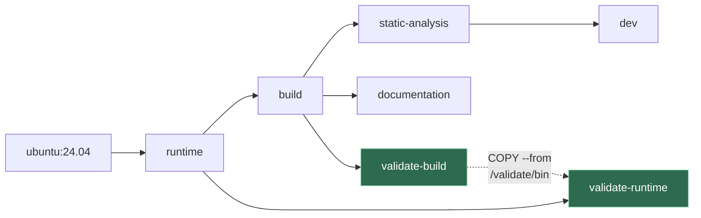
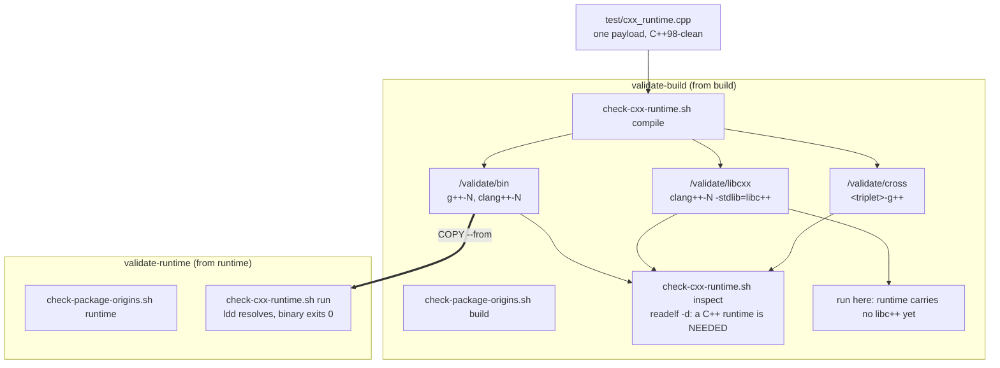
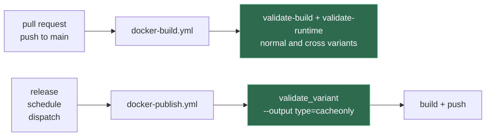

# Images validation

A gate that answers one question: **do the published images still fill their purpose?**

Two things can quietly take that away, and neither shows up as a failed build:

| Where | What it can do |
| --- | --- |
| [`Dockerfile`](../Dockerfile) - the snapshot realignment | `apt-get dist-upgrade --allow-downgrades` can hand a package back to the Ubuntu archive, replacing a PPA version with a much older one |
| [`Dockerfile`](../Dockerfile) - the runtime cleanup | `apt-get purge --auto-remove` can take more than it was asked to |
| [`scripts/install/binutils.sh`](../scripts/install/binutils.sh) | cross packages install best-effort, and the log that says so is silenced by `--silent=yes` |

The last one is the sharpest: without this gate, a `-cross` image that installed **zero** cross
toolchains builds green and says nothing.

## The two rules

**1. No version number is written down.** Renovate owns every version, through the annotated
`ARG` block at the top of the [`Dockerfile`](../Dockerfile). A validation suite that repeated
those versions would be a second source of truth to keep in step, so this one never states a
version. It asserts **origin** instead: *the installed version of a package must come from the
repository that is supposed to provide it*.

That is what catches a downgrade, with nothing to maintain:

```console
$ apt-cache policy libstdc++6
  Installed: 16-20260315-1ubuntu1~24~ppa1
 *** 16-20260315-1ubuntu1~24~ppa1 500
        500 https://ppa.launchpadcontent.net/ubuntu-toolchain-r/test/ubuntu noble/main amd64
     14.2.0-4ubuntu2~24.04.1 500                     <-- what the archive would give instead
        500 http://archive.ubuntu.com/ubuntu noble-updates/main amd64
```

Letting the archive win here swaps libstdc++ 16 for 14 in `runtime`, silently, while `build`
still has GCC 15/16.

**2. What is installed is discovered, not declared.** The compilers to exercise are obtained by
asking the installers that put them there:

```sh
scripts/install/gcc.sh  --list-installed
scripts/install/llvm.sh --list-installed
```

`gcc.sh` and `llvm.sh` own how their packages are named, so they are the ones that can tell a
compiler apart from the `gcc-<major>-base` and `gcc-<major>-multilib` packages that `libgcc-s1`
and `libstdc++6` drag in. The gate holds no second opinion about it, and no helper of its own -
the checks invoke those two scripts directly.

`--list-installed` is a pure query: it is dispatched before the root precondition, before
`gcc.sh` adds the toolchain PPA, and before `llvm.sh` fetches the apt.llvm.org signing key. A
check that asks what is installed must not modify what it is asking about.

The gate passes no `--versions`, which is what makes it report *every* installed major. Given
one explicitly, `--list-installed` narrows to it - `--versions=">=13"` reports only the installed
majors from 13 up.

So a `GCC_VERSIONS=">=15"` that resolved to two majors is exercised as two majors, and the
selector is re-implemented nowhere.

**Origin is asserted only for the majors the build argument names.** The distribution's own GCC
arrives as a `build-essential` dependency, from the Ubuntu archive, and is a legitimate
inhabitant of the image - demanding that *every* installed compiler come from the PPA would
fail on it. It still gets compiled and run: it is in the image, so it should work.

When a build argument is a selector (`>=15`, `latest-stable`) rather than bare majors, which
majors it produced cannot be recomputed, so the check falls back to requiring that at least one
installed compiler comes from the expected repository.

## Where it runs

Two throwaway stages. Nothing published inherits them, so no image gains a layer, and `dev`
stays the last stage in the file so a bare `docker build .` is unchanged.



The dotted edge is the point of the whole design. Binaries are compiled in `build` and executed
in `runtime`, which is the only way to prove that what `runtime` ships can still run what
`build` produces. `COPY --from` is a native BuildKit cross-stage copy, so this costs one compile
and one exec - no image is loaded onto the host, nothing is pulled from a registry.

## What is checked



The payload is compiled once per stable standard the compiler reports, for every installed
compiler. It is deliberately trivial and deliberately C++98-clean: its job is not to exercise
language features - the compiler already guarantees those - but to produce a binary that
dynamically links the C++ runtime and then resolves it.

`inspect` exists because a statically linked payload would resolve nothing at run time, which
would make the whole runtime check pass while proving nothing.

| Directory | Inspected in | Executed in |
| --- | --- | --- |
| `bin/` - native, libstdc++ | `build` | **`runtime`** |
| `libcxx/` - native, libc++ | `build` | `build` |
| `cross/` - foreign architecture | `build` | nowhere yet |

Cross targets are the one thing taken from the build argument rather than from the image.
`BINUTILS_TARGETS` is expanded by `binutils.sh --list-targets`, so an alias such as `common`
resolves to the triplets it names. Asking the image what it installed would agree with whatever
happened - including a target [binutils.sh](../scripts/install/binutils.sh) skipped silently,
which is the failure this is here to catch.

## The scripts

All live in [`scripts/checks/`](../scripts/checks/) and run from inside an image.

| Script | Purpose |
| --- | --- |
| `check-package-origins.sh <build\|runtime>` | every toolchain package comes from the repository that owns it |
| `check-cxx-runtime.sh <compile\|inspect\|run> <directory>` | build the payload, prove it links dynamically, prove it runs |
| `check-compiler-supported-cxx-standards.sh [--stable] [--greatest] [compiler]` | which C++ standards a compiler accepts |

They reach [`scripts/install/`](../scripts/install/) by relative path, which is why the validate
stages copy `scripts/` whole rather than `scripts/checks/` alone. A layout that separates the two
fails with `cannot find scripts/install next to scripts/checks` rather than silently finding no
compilers.

Each reports **every** failure before exiting, so one run tells you everything that is wrong.

### Standards detection

`check-compiler-supported-cxx-standards.sh` probes the compiler and reports what it accepts,
ordered by `__cplusplus`:

```console
$ scripts/checks/check-compiler-supported-cxx-standards.sh --stable g++-16
c++03 -> __cplusplus=199711
c++11 -> __cplusplus=201103
...
c++26 -> __cplusplus=202400

$ scripts/checks/check-compiler-supported-cxx-standards.sh --greatest --stable g++-16
c++26
```

Order by `__cplusplus`, never by the flag name: sorting `c++98 c++11 c++26` as text or as
versions puts `c++98` last, because 98 is greater than 26.

`--stable` keeps only final spellings, dropping drafts such as `c++2c`. A draft and the final
name it anticipates share a `__cplusplus` value, so the payload is compiled once per distinct
value rather than once per spelling.

## In CI



On a pull request the validate stages are appended to the stage list the job already builds, so
they cost a cache hit plus their own `RUN`. Before publishing they run as `cacheonly` solves -
only the exit status matters, and the layers they build are the ones the pushes then reuse from
the local cache. A stage that lost a package never reaches a registry.

## Running it locally

```sh
docker buildx build --target validate-build .
docker buildx build --target validate-runtime .

# The cross variant, which is where a silently skipped triplet shows up
docker buildx build --target validate-build \
  --build-arg BINUTILS_TARGETS=common .
```

The scripts also run against a plain checkout, which is the quickest way to iterate on them.
They discover whatever compilers the host has, so expect a wider matrix than an image produces:

```sh
scripts/checks/check-cxx-runtime.sh compile /tmp/validate
scripts/checks/check-cxx-runtime.sh inspect /tmp/validate
scripts/checks/check-cxx-runtime.sh run     /tmp/validate/bin

GCC_VERSIONS=15 LLVM_VERSIONS=22 scripts/checks/check-package-origins.sh build
```

To narrow the matrix, copy `scripts/` elsewhere and stub `gcc.sh`/`llvm.sh` `--list-installed`
to return only the majors you care about.

## Proving the gate can fail

A gate nobody has seen fail is a gate nobody should trust. Each fault below must turn the
corresponding check red:

| Inject | Caught by |
| --- | --- |
| `apt-get install -y --allow-downgrades libstdc++6=<archive version>` in `runtime` | the origin check, then `run` with a `GLIBCXX` error |
| `apt-get purge -y libstdc++-15-dev` in `build` | `compile` |
| add `-static` to the compile line | `inspect`, with no C++ runtime in `NEEDED` |
| remove a triplet from `binutils.sh` | `inspect`, on the cross binaries |

## What this deliberately does not check

- **That language features work.** The compiler guarantees those. Testing them would grow a
  payload per standard and catch nothing this gate is for.
- **Cross binaries are linked and inspected, never executed.** `runtime` is x86-64 only; running
  foreign binaries needs QEMU and a multi-platform `runtime` (see issue #33). Linking already
  proves the cross libc and libstdc++ survived.
- **libc++ on `runtime`.** `runtime` carries no libc++ yet, so those binaries are exercised in
  `build`. When libc++ lands in `runtime`, they cross over too.
- **`static-analysis`, `documentation`, `dev`.** All inherit `build`, and every operation that
  can remove or downgrade a package happens at or below `build`.
- **Published images, by digest.** These are build-time stages: they validate what the build
  produced, not what a registry currently serves.
