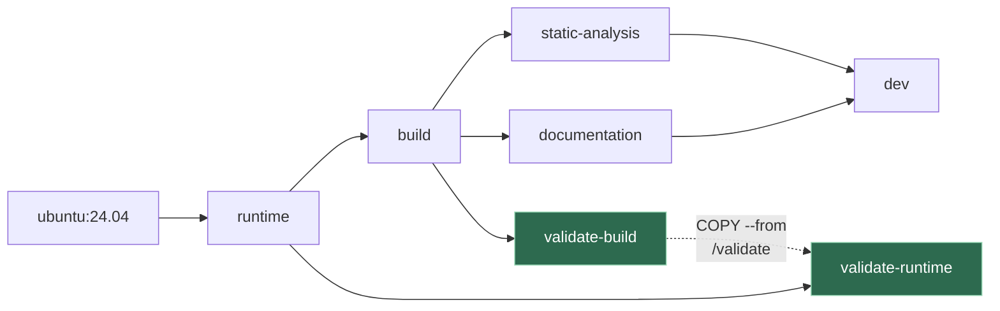
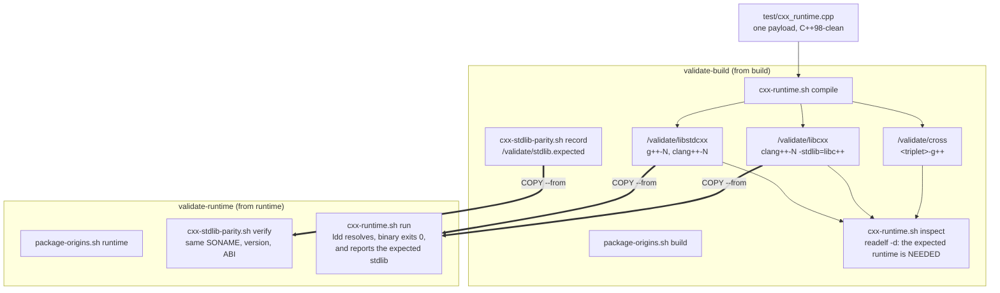
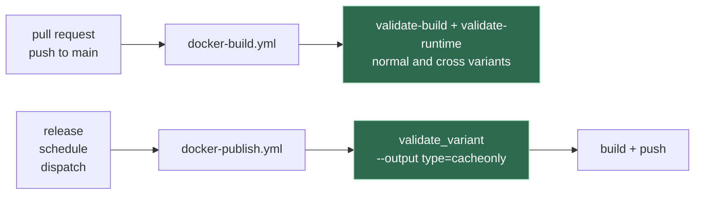

# Images validation

A gate that answers one question: **do the published images still fill their purpose?**

Two things can quietly take that away, and neither shows up as a failed build:

| Where | What it can do |
| --- | --- |
| [`Dockerfile`](../Dockerfile) - the snapshot realignment | `apt-get dist-upgrade --allow-downgrades` can hand a package back to the Ubuntu archive, replacing a PPA version with a much older one |
| [`Dockerfile`](../Dockerfile) - the runtime cleanup | `apt-get purge --auto-remove` can take more than it was asked to |
| [`scripts/install/binutils.sh`](../scripts/install/binutils.sh) | cross packages install best-effort, and the log that says so is silenced by `--silent=yes` |

The last one is the sharpest: without this gate, a `-cross` image that installed **zero** cross
toolchains builds green and says nothing.

## The two rules

### 1 - No version number is written down

Renovate owns every version, through the annotated `ARG` block at the top of the [`Dockerfile`](../Dockerfile).  
A validation suite that repeated those versions would be a second source of truth to keep in step, so this one never states a version.  
It asserts **origin** instead: *the installed version of a package must come from the
repository that is supposed to provide it*.

That is what catches a downgrade, with nothing to maintain:

```console
$ apt-cache policy libstdc++6
  Installed: 16-20260315-1ubuntu1~24~ppa1
 *** 16-20260315-1ubuntu1~24~ppa1 500
        500 https://ppa.launchpadcontent.net/ubuntu-toolchain-r/test/ubuntu noble/main amd64
     14.2.0-4ubuntu2~24.04.1 500                     <-- what the archive would give instead
        500 http://archive.ubuntu.com/ubuntu noble-updates/main amd64
```

Letting the archive win here swaps libstdc++ 16 for 14 in `runtime`, silently, while `build` still has GCC 15/16.

### 2 - What is installed is discovered, not declared

The compilers to exercise are obtained by asking the installers that put them there:

```sh
scripts/install/gcc.sh  --list-installed
scripts/install/llvm.sh --list-installed
```

`gcc.sh` and `llvm.sh` own how their packages are named, so they are the ones that can tell a
compiler apart from the `gcc-<major>-base` and `gcc-<major>-multilib` packages that `libgcc-s1`
and `libstdc++6` drag in. The gate holds no second opinion about it, and no helper of its own -
the checks invoke those two scripts directly.

`--list-installed` is a pure query: it is dispatched before the root precondition, before
`gcc.sh` adds the toolchain PPA, and before `llvm.sh` fetches the apt.llvm.org signing key. A
check that asks what is installed must not modify what it is asking about.

The gate passes no `--versions`, which is what makes it report *every* installed major. Given
one explicitly, `--list-installed` narrows to it - `--versions=">=13"` reports only the installed
majors from 13 up.

So a `GCC_VERSIONS=">=15"` that resolved to two majors is exercised as two majors, and the
selector is re-implemented nowhere.

**Origin is asserted only for the majors the build argument names.** The distribution's own GCC
arrives as a `build-essential` dependency, from the Ubuntu archive, and is a legitimate
inhabitant of the image - demanding that *every* installed compiler come from the PPA would
fail on it. It still gets compiled and run: it is in the image, so it should work.

When a build argument is a selector (`>=15`, `latest-stable`) rather than bare majors, which
majors it produced cannot be recomputed, so the check falls back to requiring that at least one
installed compiler comes from the expected repository.

## Where it runs

Two throwaway stages. Nothing published inherits them, so no image gains a layer, and `dev`
stays the last stage in the file so a bare `docker build .` is unchanged.



The dotted edge is the point of the whole design.  
Binaries are compiled in `build` and executed in `runtime`, which is the only way to prove that what `runtime` ships can still run what `build` produces.  
`COPY --from` is a native BuildKit cross-stage copy, so this costs one compile and one exec - no image is loaded onto the host, nothing is pulled from a registry.

## What is checked



The payload is compiled once per stable standard the compiler reports, for every installed
compiler. It is deliberately trivial and deliberately C++98-clean: its job is not to exercise
language features - the compiler already guarantees those - but to produce a binary that
dynamically links the C++ runtime and then resolves it.

`inspect` exists because a statically linked payload would resolve nothing at run time, which
would make the whole runtime check pass while proving nothing.

| Directory | Holds | Inspected in | Executed in |
| --- | --- | --- | --- |
| `libstdcxx/` | `g++-N` and `clang++-N`, native | `build` | **`runtime`** |
| `libcxx/` | `clang++-N -stdlib=libc++`, native | `build` | **`runtime`** |
| `cross/` | `<triplet>-g++`, foreign architecture | `build` | nowhere yet |

Each tree is named after the **standard library its binaries link**, not after the compiler that
produced them: what has to be present at run time is the library, and one tree can hold both
compilers. That is why `clang++` appears twice - left alone it links libstdc++, GCC's being the
Linux default, which is the whole reason `-stdlib=libc++` has to be asked for explicitly.

The name is then the expectation, checked in the `NEEDED` entry `inspect` reads and in the
`stdlib=` line the payload prints. Accepting either implementation in either tree is what would
let a `-stdlib=libc++` that quietly fell back to libstdc++ pass both.

### Parity: the same library on both sides

Running the binaries proves the runtime works. It does not say *why* when it does not, because a
version skew surfaces as an unresolved symbol and names nothing useful.

So `validate-build` records what it compiled against and `validate-runtime` checks it still has it:

```console
$ cxx-stdlib-parity.sh record /validate/stdlib.expected
  libc++ libc++.so.1 22.1.8 LIBCPP_ABI_1
  libstdc++ libstdc++.so.6 16 GLIBCXX_3.4.35
```

The `SONAME` is the key, because the `SONAME` is the whole contract: it is what the linker writes
into a binary and the only name the loader ever looks up. Two libc++ releases coexist exactly when
their SONAMEs differ - apt.llvm.org gives its versioned runtimes one of their own,
`libc++.so.1.0.20` against `libc++.so.1` - and a binary needing one is then untouched by the other.
Counting installed libraries would call that a problem; keying on the `SONAME` asks the only
question that decides whether a binary loads. It also collapses multilib for free: the 32-bit and
x32 libstdc++ share a `SONAME` with the 64-bit one, so `build`'s three rows and `runtime`'s one
are the same single line.

The two implementations are then compared differently, because only one of them is ordered:

| Implementation | `version` | `abi` | Why |
| --- | --- | --- | --- |
| `libstdc++` | equal | `runtime` **>=** `build` | GNU symbol versions are backward compatible: a library above the recorded `GLIBCXX_` still defines everything below it |
| `libc++` | equal | equal | no symbol versions at all, so there is no ordering to be lenient with |

Both sides read their answer from [`cxx-stdlibs.sh`](../scripts/checks/cxx-stdlibs.sh), whose
library view needs no compiler, no binutils and no headers - which is what lets it answer inside
`runtime` at all.

Two things it will not pretend to know:

- **The Debian revision is stripped**, so two apt.llvm.org snapshots of one upstream release both
  read `22.1.8`. Parity is the *precise* signal; `run` remains the ground truth.
- **One `SONAME` answered by two releases is refused, not collapsed.** Which of them a binary
  loads is the loader's decision, so neither side of the comparison would mean anything.
  A binutils-less image is where that can arise: `cxx-stdlibs.sh` then approximates the `SONAME`
  from the file name, and the name alone cannot tell `libc++.so.1.0.20` from `libc++.so.1`.
  These images install one libc++ and never meet it - `llvm.sh --mode=runtime` refuses the majors
  whose packages carried one, and apt refuses two libc++ `-dev` at once - but the check says so
  rather than picking one.

Cross targets are the one thing taken from the build argument rather than from the image.
`BINUTILS_TARGETS` is expanded by `binutils.sh --list-targets`, so an alias such as `common`
resolves to the triplets it names. Asking the image what it installed would agree with whatever
happened - including a target [binutils.sh](../scripts/install/binutils.sh) skipped silently,
which is the failure this is here to catch.

## The scripts

All live under [`scripts/checks/`](../scripts/checks/), and the gate runs them from inside a
built image.

Two of them are implementation details of this repository - they know its package origins and
ask its installers what is present - so they sit in
[`scripts/checks/details/`](../scripts/checks/details/):

| Script in [`details/`](../scripts/checks/details/) | Purpose |
| --- | --- |
| `package-origins.sh <build\|runtime>` | every toolchain package comes from the repository that owns it |
| `cxx-runtime.sh <compile\|inspect\|run> <directory>` | build the payload, prove it links dynamically, prove it runs |
| `cxx-stdlib-parity.sh <record\|verify> <file>` | the stage that runs the binaries has the libraries the stage that built them used |

One level up sit the two that depend on nothing here. The gate uses both, but they answer on any
machine, checkout or not:

| Script in [`checks/`](../scripts/checks/) | Purpose | Used by |
| --- | --- | --- |
| `cxx-standards.sh [--stable] [--greatest] [--format=<default\|std\|cplusplus>] [compiler]` | which C++ standards a compiler accepts | `cxx-runtime.sh compile` |
| `cxx-stdlibs.sh [--view] [--stdlib] [--compilers] [--format]` | which standard libraries are installed, and what ABI they expose | `cxx-stdlib-parity.sh`, `package-origins.sh` |

`package-origins.sh` uses it for the one thing it cannot write down: apt.llvm.org has spelled the
libc++ runtime three ways - `libc++1-17t64`, `libc++1-18`, then plain `libc++1` from LLVM 20,
where the major left the name altogether. A check naming one of those keeps passing on the two it
cannot see, so the package is discovered from the installed library instead and origin asserted on
whatever answer comes back.

The `details/` pair reaches [`scripts/install/`](../scripts/install/) by relative path, which is
why the validate stages copy `scripts/` whole rather than `scripts/checks/details/` alone. A
layout that separates the two fails with `cannot find scripts/install two levels above
scripts/checks/details` rather than silently finding no compilers.

This is not the top-level [`scripts/details/`](../scripts/details/). Both names mean the same
thing - implementation details of the directory that encloses them - but the top-level one is
host-side tooling that `.dockerignore` keeps out of the build context entirely, whereas these
checks have to ship *into* the image in order to validate it.

Each reports **every** failure before exiting, so one run tells you everything that is wrong.

### Standards detection

`cxx-standards.sh` probes the compiler and reports what it accepts,
ordered by `__cplusplus`:

```console
$ scripts/checks/cxx-standards.sh --stable g++-16
c++03 -> __cplusplus=199711
c++11 -> __cplusplus=201103
...
c++26 -> __cplusplus=202400
```

Order by `__cplusplus`, never by the flag name: sorting `c++98 c++11 c++26` as text or as
versions puts `c++98` last, because 98 is greater than 26.

`--stable` keeps only final spellings, dropping drafts such as `c++2c`. A draft and the final
name it anticipates share a `__cplusplus` value, so the payload is compiled once per distinct
value rather than once per spelling.

Which standards are reported and how they are reported are two separate choices. `--stable` and
`--greatest` pick the rows; `--format` narrows each row to one field, which is what makes the
output usable as a value rather than as a report:

```console
$ scripts/checks/cxx-standards.sh --greatest --stable --format=std g++-16
c++26

$ scripts/checks/cxx-standards.sh --greatest --stable --format=cplusplus g++-16
202400
```

| `--format` | Reports | Example |
| --- | --- | --- |
| `default` | both fields | `c++23 -> __cplusplus=202302` |
| `std` | the standard spelling alone | `c++23` |
| `cplusplus` | the `__cplusplus` value alone | `202302` |

`std` is spelled the way the compiler spells it, so it can be fed straight back to it as
`-std=$(... --greatest --stable --format=std g++-16)`. `cplusplus` reports distinct values only:
`c++98` and `c++03` both answer `199711`, and a draft repeats the value of the final name it
anticipates.

## In CI



On a pull request the validate stages are appended to the stage list the job already builds,
so they cost a cache hit plus their own `RUN`.
Before publishing they run as `cacheonly` solves - only the exit status matters,
and the layers they build are the ones the pushes then reuse from the local cache.  
A stage that lost a package never reaches a registry.

## Running it locally

```sh
docker buildx build --target validate-build .
docker buildx build --target validate-runtime .

# The cross variant, which is where a silently skipped triplet shows up
docker buildx build --target validate-build \
  --build-arg BINUTILS_TARGETS=common .
```

The scripts also run against a plain checkout, which is the quickest way to iterate on them.
They discover whatever compilers the host has, so expect a wider matrix than an image produces:

```sh
scripts/checks/details/cxx-runtime.sh compile /tmp/validate
scripts/checks/details/cxx-runtime.sh inspect /tmp/validate
scripts/checks/details/cxx-runtime.sh run     /tmp/validate/libstdcxx
scripts/checks/details/cxx-runtime.sh run     /tmp/validate/libcxx

scripts/checks/details/cxx-stdlib-parity.sh record /tmp/validate/stdlib.expected
scripts/checks/details/cxx-stdlib-parity.sh verify /tmp/validate/stdlib.expected

GCC_VERSIONS=15 LLVM_VERSIONS=22 scripts/checks/details/package-origins.sh build
```

`record` and `verify` back to back on one host trivially agree - the point is to run them either
side of the `COPY --from`. To watch one fail, edit a version in the recorded file and verify again.

To narrow the matrix, copy `scripts/` elsewhere and stub `gcc.sh`/`llvm.sh` `--list-installed`
to return only the majors you care about.

## Proving the gate can fail

A gate nobody has seen fail is a gate nobody should trust. Each fault below must turn the
corresponding check red:

| Inject | Caught by |
| --- | --- |
| `apt-get install -y --allow-downgrades libstdc++6=<archive version>` in `runtime` | the origin check, then parity on `GLIBCXX_`, then `run` |
| `apt-get purge -y libstdc++-15-dev` in `build` | `compile` |
| add `-static` to the compile line | `inspect`, with no C++ runtime in `NEEDED` |
| remove a triplet from `binutils.sh` | `inspect`, on the cross binaries |
| drop `libc++1` from `llvm.sh`'s `runtime_libraries_for` | the origin check, then parity, then `run /validate/libcxx` |
| drop `-stdlib=libc++` from the `libcxx/` compile line | `inspect` and `run`, both naming the implementation they expected |
| edit a version in `/validate/stdlib.expected` | parity alone, before a single binary runs |

## What this deliberately does not check

- **That language features work.**  
  The compiler guarantees those. Testing them would grow a
  payload per standard and catch nothing this gate is for.
- **Cross binaries are linked and inspected, never executed.**  
  `runtime` is x86-64 only; running
  foreign binaries needs QEMU and a multi-platform `runtime` (see issue #33). Linking already
  proves the cross libc and libstdc++ survived.
- **The secondary ABIs, `-m32` and `-mx32`.**  
  `build` carries `lib32stdc++6` and `libx32stdc++6`
  through `gcc.sh --multilib`; `runtime` carries neither, and nothing here compiles a 32-bit
  payload to notice. Closing that means a `--multilib` runtime and a `-m32` arm in `compile` -
  a different axis from the one this gate covers, which is the standard library rather than
  the ABI it was built for.
- **`static-analysis`, `documentation`, `dev`.**  
  All inherit `build`, and every operation that
  can remove or downgrade a package happens at or below `build`.
- **Published images, by digest.**  
  These are build-time stages: they validate what the build
  produced, not what a registry currently serves.
