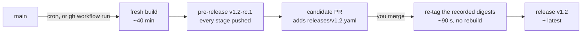
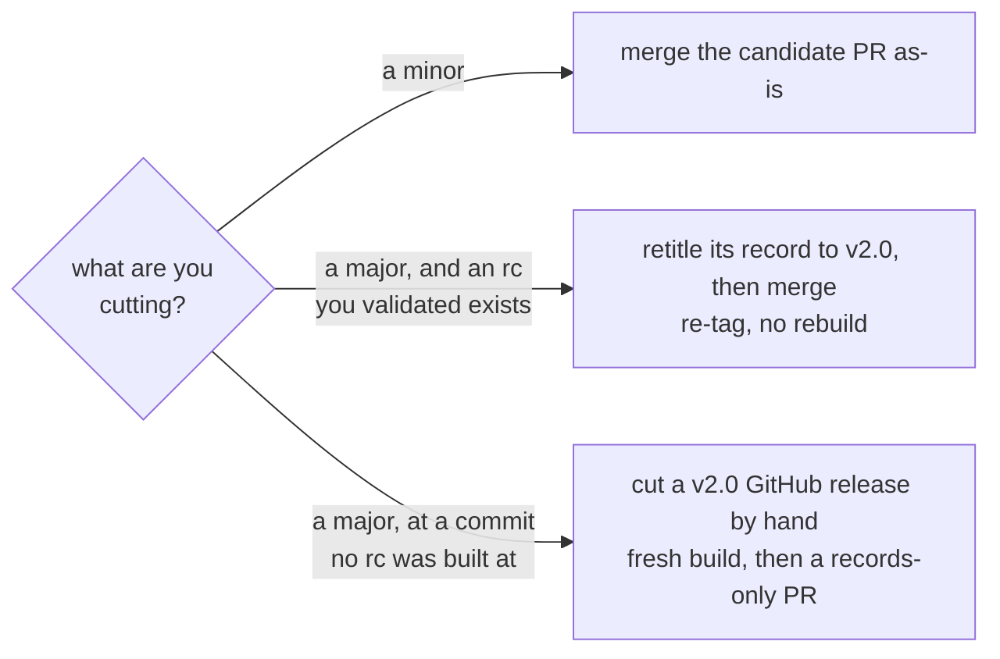

# Release process

The operator's runbook: consumers should read [Tags & versioning](../README.md#tags--versioning) instead.  
This page is about *cutting* releases, and it is the only place the cadence and the procedures are documented/stated.

## In a nutshell

An rc is **built**, a release is that same rc **re-tagged**.
Merging the candidate pull request is what promotes it:



The whole cycle, on demand:

```bash
# 1. Cut the rc - fresh build from main HEAD, ~40 min.
#    A dispatch bypasses the skip-when-unchanged check, so it always builds.
gh workflow run docker-publish.yml --ref main

# 2. Validate what it actually published, then read the candidate PR it opened.
docker pull ghcr.io/guillaumedua/cpp-toolchain:dev-v1.2-rc.1

# 3. Promote - merging the candidate PR is the entire procedure.
gh pr merge release/candidate/v1.2-rc.1 --merge
```

Substitute the rc the dispatch actually minted: **you do not choose the number**.
It is the newest release tag with its minor bumped, so with `v1.1` released the dispatch cuts `v1.2-rc.1`, and a second dispatch cuts `v1.2-rc.2` and closes the first candidate as superseded.

### Promoting that rc as a major instead

Same rc, same digests - only the record is retitled, between steps 2 and 3 above:

```bash
git fetch origin release/candidate/v1.2-rc.1
git checkout release/candidate/v1.2-rc.1
git mv releases/v1.2.yaml releases/v2.0.yaml
# then edit that file: version: "v1.2" -> version: "v2.0"
# leave candidate: untouched - it is what sources the digests being re-tagged
git commit -am "Promote v1.2-rc.1 as v2.0"
git push
```

Merging then re-tags the rc's digests to `v2.0` + `latest`.
The schema sanctions exactly this one mismatch between `version` and `candidate` - a target ending in `.0` - and `bumps` survives the rename untouched, because it is recomputed against the newest release either way.
The other route to a major, when no rc was built at the commit you want, is in [Cutting a major](#cutting-a-major).

### What you cannot do

| Not available | Why |
| ------------- | --- |
| Choose the rc number, or cut an rc *for* a given version | Computed from the newest release tag - see above |
| Cut a minor by hand as a GitHub release | Refused: it would rebuild instead of promoting, shipping an artifact nobody tested |
| Release a commit that is not on `main` | Both the build and the promotion assert containment in `main` - no cherry-pick channel |
| Move `latest` faster than one build | The byte-identical guarantee costs one rc build, always |

## The model

| Channel              | Cut by                                                | Moves `latest` | How                                                                                                     |
| -------------------- | ----------------------------------------------------- | :------------: | ------------------------------------------------------------------------------------------------------- |
| **rc** (`v1.2-rc.1`) | schedule - 8th and 22nd, 4am UTC (or manual dispatch) |       ❌       | fresh build from `main`, published as a GitHub pre-release; skipped when nothing image-relevant changed |
| **minor** (`v1.2`)   | **you**, by merging the candidate PR                  |       ✅       | the digests recorded in `releases/v1.2.yaml` are re-tagged - no rebuild                                 |
| **major** (`v2.0`)   | **you**, by cutting a `vX.0` GitHub release           |       ✅       | fresh build (the image contract changed - only a human decides that)                                    |

The promotion guarantee, stated precisely:

- **a release is byte-identical to the rc** it came from,
- because promotion re-tags a digest recorded in git and refuses to proceed if that digest moved,  
  not merely because it re-tags rather than rebuilds.

Every moving part lives in two workflows and one schema:

- [docker-publish.yml](../.github/workflows/docker-publish.yml) - builds rcs and majors,  
  opens the candidate PR, and promotes on merge.
- [release-candidate-check.yml](../.github/workflows/release-candidate-check.yml) - the merge gate on candidate PRs:
  - schema
  - tag consistency
  - bumps recompute
  - a smoke test of the image **by digest**.
    Make it a required status check on `main`.
- [scripts/details/check-release-file.py](../scripts/details/check-release-file.py) - the single definition of the `releases/v*.yaml` schema and of the stage lists.

## The normal path

1. On the 8th or 22nd an rc is built and a **candidate PR** appears (branch `release/candidate/v1.2-rc.1`, adding `releases/v1.2.yaml`).
   Its body is the manifest - what moved since the last release.
2. **Validate**: read the diff, pull the rc (`docker pull ghcr.io/guillaumedua/cpp-toolchain:dev-v1.2-rc.1`), build something real against it, check the PR is green.
3. **Merge**: that is the whole procedure - the promote job verifies the recorded digests against both registries,  
   re-tags them to `v1.2` + `latest`, and creates the GitHub release at the rc's commit.

> [!IMPORTANT]
> There is exactly one open candidate PR at any time: a new rc closes the previous candidate (comment names the successor),  
> and only the newest rc of a minor passes the supersession assert.

## Urgent fixes

Deliberately **not** a fourth channel - it is the normal path with the cron replaced by a dispatch:

1. Land the fix on `main` as usual.
2. `gh workflow run docker-publish.yml` - a dispatch bypasses the skip-when-unchanged check,  
   so it cuts the next rc immediately (~40 min) and opens the candidate PR.
3. Merge the PR once its check is green (~90 s to promote, no rebuild).

Two constraints, both enforced and neither obvious:

- **No cherry-pick channel.**  
  The main-containment assert rejects any commit not contained in `main`.  
  If `main` HEAD carries something you do not want shipped, revert it on `main` first - there is no way to release around it.
- **Total time to `latest` is bounded by the rc build**, not by the promotion.  
  If you need `latest` moved faster than one build, you cannot - that is the cost of the byte-identical guarantee.

## Rollback

`git revert` of the promotion commit does **not** move image tags back on its own - the record is gone from `main`, but `latest` still points at the reverted release.

What actually rolls back: **re-run the previous version's promotion workflow run** from the Actions tab.
Promotion is idempotent and reads its own `releases/v*.yaml`, so the old run re-tags `latest` back to the old digests in seconds.
The digests being in git is what makes this archaeology-free.

## Cutting a major

> [!NOTE]
> `v1.2`-shaped release tags are **refused**:  
> minors ship by merging a candidate, never by cutting a release.  
> A hand-cut minor would silently rebuild instead of promoting - an artifact nobody tested.



### From a validated rc

Retitle the open candidate PR instead of merging it as a minor

- rename the file to `releases/v2.0.yaml`
- set `version: "v2.0"` in it
- merge

Promotion reads the YAML, so the same digests are re-tagged to `v2.0`.

### From a commit no rc was built at

Cut a `v2.0` GitHub release by hand.  
It builds fresh (~40 min), publishes, then opens a records-only PR adding `releases/v2.0.yaml` - merge it so `releases/` stays the complete digest record (rollback depends on it).  
Merging that PR re-fires the promote job as an idempotent no-op.

## What the release process assumes

So the guarantees are not read as stronger than they are:

- The images are **unsigned**: buildx attestations and the untagged GHCR sweep are mutually exclusive, and [docker-publish.yml](../.github/workflows/docker-publish.yml) takes the sweep.  
  The digest record in `releases/` is the tamper-evidence:  
  it proves what this workflow built, not - to a third party - that this workflow built it.
- Anything holding `packages: write` or the Docker Hub token can move a tag between rc and merge.  
  That is precisely what the digest assertion catches: promotion fails loudly rather than shipping moved bytes.
- `releases/v*.yaml` is a file like any other:  
  A hand-written *real* digest that was never tested cannot be caught mechanically.  
  The smoke check covers `dev` by digest; the rest rides on review and branch protection.

### Setup prerequisites

- **`RELEASE_PR_TOKEN`** (repository secret) - a fine-grained PAT, `pull-requests: write` + `contents: read`.  
  Used for exactly one call: creating the candidate PR.  
  A PR created with `GITHUB_TOKEN` fires no `pull_request` events, so its validation checks would never run.
- **`DOCKERHUB_USERNAME` / `DOCKERHUB_TOKEN`** - read+write is sufficient; nothing deletes registry content anymore.
- Branch protection on `main` requiring the `validate-candidate` check.
- The candidate PR must be **merged by a human** (or native auto-merge enabled by one) - a merge performed with `GITHUB_TOKEN` would suppress the push event that triggers promotion.

## Failure modes

| Failure | State left behind | Recovery |
| ------- | ----------------- | -------- |
| Expired `DOCKERHUB_TOKEN` during an **rc** build | Nothing published anywhere - login precedes every push. No tag, no PR. | Rotate the secret, re-run. The next run recomputes the same rc number. |
| Expired `DOCKERHUB_TOKEN` during a **promotion** | The merge already landed: `main` records a release the registries do not have. | Rotate, then re-run the failed run - every step is idempotent (same-digest re-tags are no-ops, tag and release are upserts). |
| **Digest mismatch** at promotion | Nothing mutated - the assert runs before any re-tag. | The rc moved since it was built (a re-run, or tampering). Do **not** bypass the check: cut a fresh rc, validate *that*, promote it. |
| **"rc is superseded"** at promotion | Nothing mutated. | Only the newest rc of a minor is promotable. Promote the newer candidate; if it regressed, revert on `main` and cut a fresh rc. Reachable only via a hand-crafted record - the candidate PR machinery closes superseded PRs. |
| Expired `RELEASE_PR_TOKEN` | The rc's images and pre-release are published, but the candidate PR was never opened. | Rotate the secret, then `gh workflow run docker-publish.yml` for a fresh rc + PR. Do **not** just re-run the failed job: the skip check now sees the fresh rc tag and exits green without opening anything. |
| Candidate PR appears with **no checks** | Wrong token created it (`GITHUB_TOKEN` PRs fire no `pull_request` events). | Close and reopen the PR by hand - the reopen is human-caused, so the checks fire. |
| rc cron fails outright | No pre-release, no PR - a silence, not a signal. Actions secrets carry no expiry metadata, so nothing warns beforehand. | Check the Actions tab; if this bites repeatedly, add a failure notification to the rc job. |

> [!IMPORTANT]
> **Superseded rcs are marked and kept, never deleted**:  
> with promotion re-tagging, a release and its rc share digests (often across rcs too - `runtime` only changes when the base moves), so deleting one tag's package version can destroy another's image.  
Their pre-releases and records stay readable.
